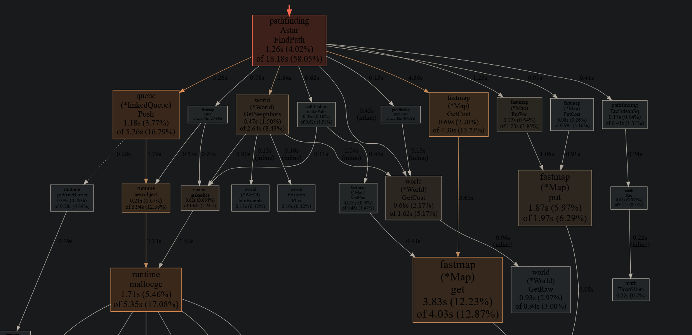

# elp-go

## Git

Pour récupérer le repo :

```shell
git clone https://github.com/Gui-Yom/elp-go
```

Pour mettre à jour le repo local :

```shell
git pull
```

Pour commit :

```shell
git add *
git commit -m "<message>"
git push origin
```

## Build

### Windows

```shell
> build.bat
ou
> go build -o target/elp-go.exe elp-go
```

### Linux

Pour build le projet il est nécessaire d'installer certains paquets : https://gioui.org/doc/install/linux

```shell
$ ./build.sh
ou
$ go build -o target/elp-go elp-go
```

## CLI

`$ elp-go -h`

```
Usage : elp-go [-args] [map file | rand] [width] [height] [fill] [seed]
  -addr value
        Host to connect to.
  -noconnect
        Do not connect to remote server.
  -nogui
        Disable GUI.
  -p int
        Specify the port to connect or listen to. (default 32145)
  -server
        Start a server.
Example usage :
  Start a server :
    $ elp-go -server
  Start a client with a map file :
    $ elp-go map.map
  Start a client with a scen file :
    $ elp-go scen0.scen
  Start a client with a randomly generated map :
    $ elp-go rand 100 100 0.1 42
```

## Tests

CLI `go test` : https://pkg.go.dev/cmd/go#hdr-Testing_flags

```shell
$ go test -c -o target/test.<name> <package>
$ target/test.<name> -test.v
```

## Benchmarks

```shell
$ go test -c -o target/bench.pathfinding.exe elp-go/internal/pathfinding
$ target/bench.pathfinding -test.v -test.paniconexit0 -test.bench . -test.run ^$ -test.benchtime 5s -test.benchmem
```

Comparer les performances depuis un certain commit :

```shell
$ benchdiff --base-ref=d1190c07f745946dd36d8894e64562874ebf32f9 --bench=AstarLinked1000$ --benchmem --benchtime=1000x --packages=elp-go/internal/pathfinding
```

### Profilage

Il est nécessaire de limiter les benchmarks pour chaque séquence de profilage. CPU :

```shell
$ target/bench.pathfinding -test.v -test.paniconexit0 -test.bench <spec> -test.run ^$ -test.benchtime 10s -test.outputdir target -test.cpuprofile pathfinding.<spec>.cpu.prof
```

Mémoire :

```shell
$ target/bench.pathfinding -test.v -test.paniconexit0 -test.bench <spec> -test.run ^$ -test.benchtime 10s -test.benchmem -test.outputdir target -test.memprofile pathfinding.<spec>.mem.prof
```

Lecture des données de profilage avec pprof. Interface web interactive avec `pprof -http : cpu.prof`

#### Bottlenecks identifiés

Pour Dijkstra :

1. Priority queue (push O(n) pour la linked list et push/pop pour le pairing heap)
2. Map des coûts (get/put)
3. GetNeighbors (appel pour chaque tile, allocations en masse)

Pour A* (petite carte 300) :

1. Map des coûts
2. Priority queue
3. GetNeighbors

Pour A* (grande carte 10000) :

1. Map des coûts
2. Map des tiles
3. Priority queue & GetNeighbors (impact similaire)

On note aussi un coût non négligeable dû au boxing (interface{}) des ifaces.

#### Pistes d'améliorations restantes

1. Meilleure implémentation de priority queue (linked list O(n) -_-, impl pairing heap probablement foireuse). Meilleure
   gestion de la mémoire en sachant la taille du problème afin de limiter les allocs.
2. Précalcul des voisins pour éviter les allocs répétées au runtime. Pourrait quadrupler la taille en mémoire donc
   moyen.
3. Les maps costs et parentChain pourraient être la même map (Position -> (Position, Coût)) pour économiser de la place
4. Interface graphique améliorée
5. Plus de tâches différentes
6. Temps simulé: on prenne compte des chemins pour faire de l'attribution de tâches

### Après profilage

Baseline : d1190c07f745946dd36d8894e64562874ebf32f9 / Current :
beb57836816e4b3c4c1f3f5db5ca1a40d8494636, [diff](https://github.com/Gui-Yom/elp-go/compare/db3e157000fe19cae93375a90cd94d139f487c3b...beb57836816e4b3c4c1f3f5db5ca1a40d8494636)

CPU:

| name               | old (µs/op) | new (µs/op) | delta   |
|--------------------|-------------|-------------|---------|
| DijkstraLinked100  | 7.94k ± 4%  | 5.39k ± 4%  | -32.12% |
| DijkstraLinked1000 | 2.04M ± 0%  | 1.46M ± 1%  | -28.51% |
| AstarLinked100     | 202 ± 5%    | 82 ±148%    | -59.30% |
| AstarLinked1000    | 2.64k ± 9%  | 0.60k ± 1%  | -77.33% |
| AstarLinked10000   | 22.5k ± 2%  | 6.7k ± 4%   | -70.08% |

MEM:

| name               | old (alloc/op) | new (alloc/op) | delta   |
|--------------------|----------------|----------------|---------|
| DijkstraLinked100  | 3.72MB ± 0%    | 1.19MB ± 0%    | -68.01% |
| DijkstraLinked1000 | 329MB ± 0%     | 110MB ± 0%     | -66.46% |
| AstarLinked100     | 122kB ± 1%     | 36kB ± 0%      | -70.43% |
| AstarLinked1000    | 1.63MB ± 0%    | 0.46MB ± 0%    | -71.57% |
| AstarLinked10000   | 14.2MB ± 0%    | 4.1MB ± 0%     | -70.85% |



#### Modifications

- Nouvelle impl HashMap Position -> Position et Position -> Coût (int64 -> int64)
- Nouvelle impl linked list pour la priority queue
- Utilisation d'un switch plutôt qu'une map pour le coût des tiles
- Prédimensionnement de certaines structures dans les algos
- Spécialisation des structures

## Détails

### Organisation du code

- `main.go`: Point d'entrée partagé, parsing des arguments
- `internal/`
    - `agent.go`: Agents et résolution des tâches
    - `client.go`: Code relatif au client, gui
    - `net.go`: Outils réseau et serialization
    - `scenario.go`: Scenario et tâches
    - `server.go`: Code relatif au serveur
    - `fastmap/`:
        - `fastmap.go`: HashMap rapide
    - `pathfinding/`
        - `astar.go`: A*
        - `dijkstra.go`: Dijkstra
        - `heuristics.go`: fonctions heuristiques pour A*
        - `pathfinding.go`: Interfaces et utilités
    - `queue/`
        - `queue.go`: Interface priority queue
        - `heap.go`: Queue basée sur un heap
        - `linked.go`: Queue basée sur une linked list
        - `pairing.go`: Queue basée sur un pairing heap
    - `world/`
        - `world.go`: Cartes et tiles

Fichiers `*_test.go` : Code de test et benchmarks

### Dépendances

- [gioui](https://gioui.org) : GUI cross-plateforme
- [giocanvas](https://github.com/ajstarks/giocanvas) : API Canvas pour gioui
- [cbor](https://github.com/fxamacker/cbor) : Serialization CBOR pour les échanges réseaux
- [testify](https://github.com/stretchr/testify) : assertions pour les tests

### Fonctionnement

Client :

- Connexion au serveur
- Envoi du scénario (carte + agents + tâches + paramètres)
- Ouverture d'une fenêtre avec la carte
- Récupération des résultats
- Fermeture de la connexion

Serveur (pour chaque client) :

- Récupération du scénario
- Résolution du scénario
- Envoi des résultats (opérations + statistiques)
- Retour à l'étape 1

## Références

https://doi.org/10.1137/1.9781611973198.7

Fastmap modifiée de : https://github.com/brentp/intintmap, impl originale (java) : https://github.com/mikvor/hashmapTest

## Présentation
- présentation générale + démo du programme -> Chaymae 
- serveur, client, goroutines, test goroutines -> Guillaume
- recherche de chemins : djikstra et astar, heuristiques, test pathfinding -> Julie, Guillaume
- pistes d'amélioration -> à voir